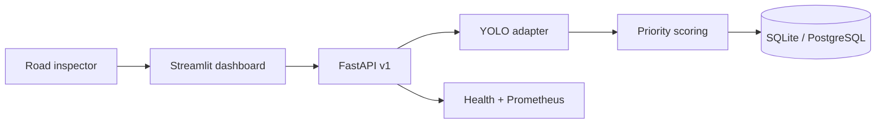

# RoadWatch Qatar AI

[](https://github.com/othmanayari049-wq/RoadWatch-Qatar-AI/actions/workflows/ci.yml)
[](https://github.com/othmanayari049-wq/RoadWatch-Qatar-AI/actions/workflows/codeql.yml)
[](https://www.python.org/)
[](LICENSE)
[](tests)
[](pyproject.toml)

An end-to-end, production-oriented computer-vision platform for detecting visible road
damage, organizing geotagged inspections, and helping human reviewers prioritize field
verification.

RoadWatch combines a reproducible RDD2022 training pipeline, YOLO inference adapter,
versioned FastAPI service, PostgreSQL-compatible persistence, Streamlit operations dashboard,
interactive map, Prometheus metrics, containers, automated tests, and model-governance
documentation.

> **Honest model status:** the repository does not ship trained weights or claim benchmark
> accuracy. Train and evaluate a checkpoint using the included pipeline, then place it at
> `models/best.pt`. Until then, the API remains live but correctly reports **not ready**.

## What it detects

| RDD2022 code | Damage class | Output |
|---|---|---|
| D00 | Longitudinal crack | Box, confidence, priority score |
| D10 | Transverse crack | Box, confidence, priority score |
| D20 | Alligator crack | Box, confidence, priority score |
| D40 | Pothole | Box, confidence, priority score |

The priority score is a documented heuristic for inspection triage. It is not physical crack
severity, Pavement Condition Index, structural capacity, or a maintenance recommendation.

## Platform capabilities

- **Computer vision:** pluggable Ultralytics YOLO detector with strict RDD2022 label mapping.
- **Safe ingestion:** bounded JPEG/PNG/WebP uploads, decoder verification, EXIF correction,
  pixel limits, and no silent generic-model fallback.
- **Explainable triage:** reproducible confidence/visible-area/class-prior scoring.
- **Inspection API:** versioned resources, OpenAPI, request IDs, liveness/readiness, pagination,
  stable errors, and Prometheus metrics.
- **Geospatial workflow:** optional WGS84 coordinates, interactive Qatar-centered map, severity
  colors, inspection history, and aggregate charts.
- **Privacy-aware storage:** raw uploaded image bytes are not persisted; saving prediction
  metadata is controllable per request.
- **Reproducible ML:** official Figshare metadata, checksum verification, safe Pascal VOC
  parsing, YOLO conversion, geographic holdouts, seeded training, evaluation, and export.
- **Deployment:** non-root API/dashboard containers, PostgreSQL Compose stack, health checks,
  environment configuration, and immutable model mount.
- **Engineering quality:** strict typing, Ruff security rules, 43 tests, 92% coverage, CodeQL,
  dependency audit, Dependabot, and pre-commit hooks.
- **Responsible AI:** data card, model card, Qatar acceptance requirements, failure analysis,
  human oversight, and explicit out-of-scope uses.

## Architecture



See [the architecture document](docs/architecture.md) for component boundaries, request
flow, security choices, storage design, and scaling options.

## Quick start

### 1. Install

```bash
git clone https://github.com/othmanayari049-wq/RoadWatch-Qatar-AI.git
cd RoadWatch-Qatar-AI
python -m venv .venv
source .venv/bin/activate
python -m pip install --upgrade pip
python -m pip install -e '.[ml,dashboard,dev]'
```

On Windows PowerShell, activate with `.venv\Scripts\Activate.ps1`.

### 2. Inspect the official dataset release

RDD2022 is approximately 12.36 GB in the official Figshare release. List the individual
files before selecting downloads:

```bash
python scripts/download_rdd2022.py --list
python scripts/download_rdd2022.py --match Japan --match Norway
```

Extract downloaded archives under `data/raw/rdd2022-extracted`, then prepare YOLO data. A
country-level validation/test holdout is recommended for geographic-generalization work:

```bash
python scripts/prepare_rdd2022.py data/raw/rdd2022-extracted \
  --validation-country norway \
  --test-country united_states
```

### 3. Train and evaluate

```bash
python scripts/train.py --device 0 --epochs 100
python scripts/evaluate.py runs/detect/roadwatch-yolo26n-rdd2022/weights/best.pt \
  --split test --device 0
cp runs/detect/roadwatch-yolo26n-rdd2022/weights/best.pt models/best.pt
```

Use `--device cpu` on a CPU-only system. Training on the full dataset is GPU-intensive. The
default recipe follows the current [Ultralytics training API](https://docs.ultralytics.com/modes/train/)
and writes evaluation metrics to `artifacts/metrics.json`.

### 4. Run the application

Terminal 1:

```bash
roadwatch serve --reload
```

Terminal 2:

```bash
streamlit run src/roadwatch/dashboard/app.py
```

Open:

- Dashboard: <http://localhost:8501>
- Interactive API: <http://localhost:8000/docs>
- Readiness: <http://localhost:8000/health/ready>
- Metrics: <http://localhost:8000/metrics>

FastAPI's multipart upload design follows its [official file-upload guidance](https://fastapi.tiangolo.com/tutorial/request-files/).

## API example

```bash
curl --fail-with-body \
  -X POST http://localhost:8000/api/v1/predictions \
  -F image=@road.jpg \
  -F latitude=25.2854 \
  -F longitude=51.5310 \
  -F persist=true
```

The response contains the validated prediction ID, timestamp, model version, dimensions,
inference latency, detections, transparent priority scores, and optional location. See the
[API guide](docs/api.md) for schemas and error behavior.

## Docker deployment

Place the trained checkpoint at `models/best.pt`, then run:

```bash
export POSTGRES_PASSWORD='replace-with-a-strong-local-secret'
docker compose up --build
```

This starts PostgreSQL, the API, and the dashboard with health checks. Review the
[deployment guide](docs/deployment.md) before exposing any service to a network.

## Quality checks

```bash
python -m pip install -e '.[dev]'
make check
```

The local verified result for this commit is:

```text
43 passed
92% total branch-aware coverage
Ruff: passed
Mypy strict service-layer checks: passed
```

The Streamlit view layer is excluded from coverage and strict mypy totals because it is
framework-driven UI glue; its typed API client and underlying domain/service behavior are
tested.

## Repository structure

```text
RoadWatch-Qatar-AI/
├── configs/                  RDD2022/Ultralytics dataset configuration
├── docs/                     Architecture, API, deployment, data and model cards
├── models/                   Local trained checkpoint mount (weights Git-ignored)
├── scripts/                  Download, preparation, training, evaluation and export
├── src/roadwatch/
│   ├── api/                  FastAPI application
│   ├── dashboard/            Streamlit UI and typed API client
│   ├── domain/               Validated schemas and priority rules
│   ├── services/             Image handling and detector adapter
│   ├── storage/              SQLAlchemy repository
│   └── training/             RDD2022 conversion logic
├── tests/                    Unit and integration suite
├── Dockerfile.api
├── Dockerfile.dashboard
└── docker-compose.yml
```

## Data and evaluation

The official RDD2022 release contains **47,420 road images**, collected in six countries,
with **more than 55,000 annotated damage instances**. It is licensed CC BY 4.0. Qatar is not
among the collection countries, so RDD2022 performance cannot establish Qatar readiness.

Before a pilot, build an independent Qatar acceptance set covering dust, glare, shadows,
night scenes, road markings, repaired surfaces, different devices, and multiple road types.
Group samples by location and report per-class and condition-level results.

Primary references:

- [Official RDD2022 dataset (Figshare)](https://doi.org/10.6084/m9.figshare.21431547)
- [RDD2022 data article](https://doi.org/10.1002/gdj3.260)
- [CRDDC 2022 challenge paper](https://doi.org/10.48550/arXiv.2211.11362)
- [Ultralytics documentation](https://docs.ultralytics.com/)
- [FastAPI documentation](https://fastapi.tiangolo.com/)

Read the [data card](docs/data-card.md) and [model card](docs/model-card.md) before training
or presenting evaluation results.

## Responsible use

- A qualified human must verify detections before any field or maintenance action.
- A missed detection does not prove the road is undamaged.
- Pixel-space area is not a physical road measurement.
- Street imagery may contain faces, license plates, homes, and location metadata; collection
  requires appropriate permissions, minimization, retention, and access control.
- Never replace “Not measured” in the model card with another system's result or training-set
  performance.

## Documentation

- [Architecture](docs/architecture.md)
- [API guide](docs/api.md)
- [Deployment guide](docs/deployment.md)
- [RDD2022 data card](docs/data-card.md)
- [Detector model card](docs/model-card.md)
- [Contributing](CONTRIBUTING.md)
- [Security policy](SECURITY.md)

## Author and license

Developed by **Mohamed Othman Ayari** as a computer-engineering and applied-AI portfolio
project with a Qatar smart-infrastructure focus.

The software is available under the [Apache License 2.0](LICENSE). Dataset and model
artifacts retain their own licenses and attribution requirements.

