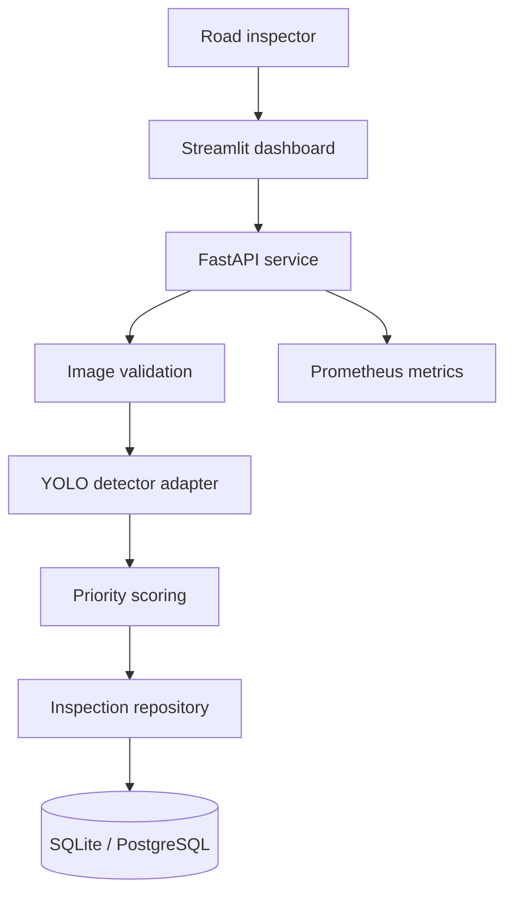

# System architecture

## Purpose

RoadWatch Qatar AI separates model inference from inspection workflow concerns. A trained
checkpoint can be replaced, evaluated, and deployed without changing the HTTP contract,
database adapter, or dashboard.

## Component boundaries

| Component | Responsibility | Must not do |
|---|---|---|
| Domain | Validated labels, boxes, predictions, and severity rules | Import a web or ML framework |
| Detector service | Convert model output to domain predictions | Store images or make maintenance decisions |
| API | Validate requests, run inference, expose versioned resources | Train models |
| Repository | Persist prediction metadata and calculate aggregates | Interpret model confidence |
| Dashboard | Support inspection, mapping, and result exploration | Bypass API validation |
| Training tools | Prepare data, train, validate, and export checkpoints | Report unmeasured metrics |

## Request flow

1. The API accepts JPEG, PNG, or WebP through a bounded multipart upload.
2. Pillow verifies the image before it is fully decoded, applies EXIF orientation, and
   converts it to RGB.
3. The configured detector performs inference in a worker thread so CPU/GPU work does not
   block the asynchronous server loop.
4. Detection labels are normalized to the four supported RDD2022 codes.
5. An explainable heuristic calculates an inspection-priority score from confidence,
   visible area, and class prior.
6. Prediction metadata is persisted only when the caller requests it. Raw image bytes are
   not stored by the reference implementation.
7. The API returns the same validated schema used by persistence and the dashboard.

## Readiness and failure design

- `/health/live` shows that the process can serve requests.
- `/health/ready` reports HTTP 503 until a supported trained checkpoint is loaded.
- The service never falls back to a generic COCO detector or generates simulated road
  damage when weights are missing.
- Unsupported checkpoint labels fail explicitly instead of being silently discarded.
- Expected image and model errors are returned through stable JSON error bodies.

## Data design

The canonical `Prediction` object is serialized as JSON for faithful schema round-tripping.
Commonly queried fields—time, coordinates, detection count, model version, and maximum
severity—also have relational columns. This provides a simple local SQLite experience while
supporting PostgreSQL in container deployments.

## Security and privacy decisions

- Content type, byte length, pixel count, and decoder validity are checked.
- XML dataset parsing uses `defusedxml`.
- Figshare downloads require HTTPS, allowlisted hosts, and MD5 verification against the
  official API metadata.
- Containers run as an unprivileged `roadwatch` user.
- CORS origins are explicit and configurable.
- Raw road images are not persisted by default architecture.
- Request identifiers and Prometheus metrics support incident diagnosis without logging
  image content.

## Scaling path

The reference deployment is intentionally modest. A larger deployment can replace:

- synchronous inference with a GPU inference server or task queue;
- local model files with a versioned artifact registry;
- PostgreSQL latitude/longitude columns with PostGIS geometries;
- one API deployment with horizontally scaled replicas;
- in-process metrics with a managed Prometheus/OpenTelemetry stack.

These are adapter changes. The domain and HTTP schemas can remain stable.

